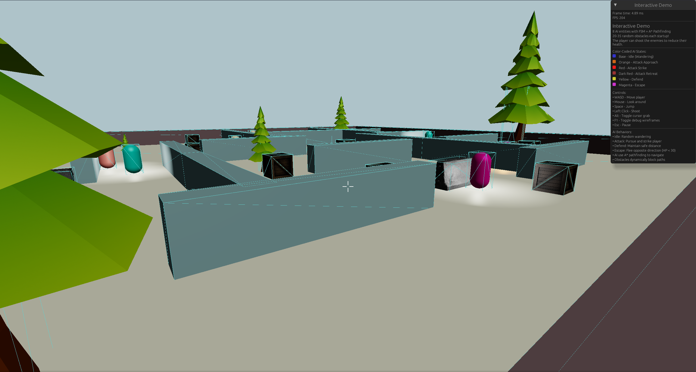
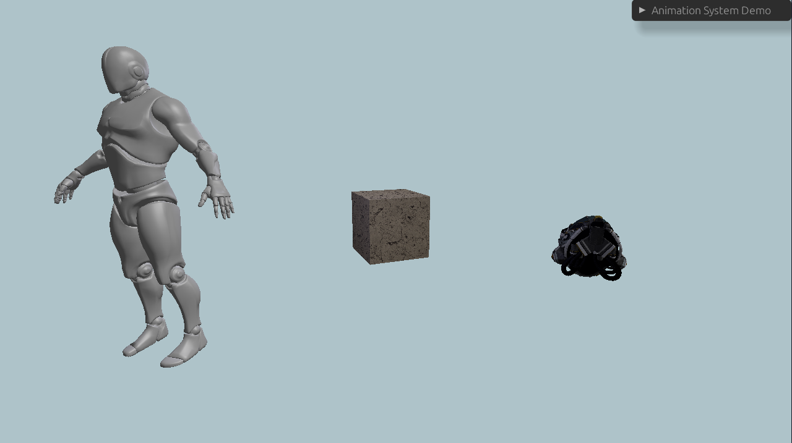
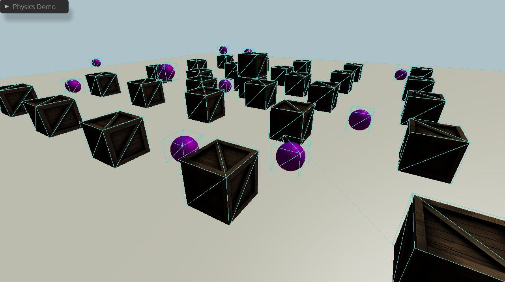

# Gears

A 3D game engine written in Rust with an Entity Component System architecture, physics simulation, and pathfinding.

## Examples

Run examples with:

```bash
cargo run --release --example <example_name>
```

Available examples:

- `minimal` - Basic scene with a rotating sphere
- `custom_window` - UI controls for manipulating objects
- `physics` - Physics simulation with falling objects
- `animations` - Basic GLTF animation system and complex mesh loading
- `pathfinding` - A* pathfinding with obstacle navigation
- `sandbox` - Lights, physics, and player controls
- `interactive` - HFSM controlled entities with pathfinding and user interaction







## Architecture

The engine is organized into several crates:

- `gears-app` - Main application layer, game loop and systems
- `gears-core` - Core functionality and utilities
- `gears-ecs` - Entity Component System implementation with components
- `gears-gui` - GUI integration with egui
- `gears-macro` - Procedural macros for convenience
- `gears-renderer` - Rendering backend and animantions

## Features

### Rendering
- 3D model loading (OBJ, GLTF formats)
- Multiple light types: colored ambient, directional, and point lights
- Animation queues with configurable transitions
- Debug wireframe visualization for colliders

### Physics
- Rigid body dynamics with mass and velocity
- AABB (Axis-Aligned Bounding Box) collision detection
- Static and dynamic body support
- Gravity simulation
- Collision response and resolution

### Entity Component System
- Flexible component-based architecture
- Entity queries with read/write locks
- Async system execution
- Component markers for filtering and categorization
- Macros for simplified entity creation

### Camera System
- First-person camera with mouse look
- Fixed camera positions
- Look-at controller for targeting specific points
- Configurable movement controllers with WASD controls
- Adjustable movement speed and sensitivity

### AI and Pathfinding
- A* pathfinding algorithm with multiple heuristic options
- Dynamic obstacle avoidance
- Finite State Machine (FSM) for AI behaviors
- Configurable states and substates
- Grid-based navigation with customizable cell sizes
- Target tracking and pursuit mechanics

### User Interface
- egui integration for custom windows and overlays
- Interactive sliders and controls
- Real-time component manipulation

### Input Handling
- Mouse and keyboard input
- Camera rotation and look controls
- Player movement (WASD + Space/Shift for vertical movement)
- Cursor locking and release (Alt key)
- Shooting mechanics with raycasting

## Requirements

- MSRV is Rust 1.89
- GPU with support for Vulkan, DirectX 12, Metal, or OpenGL ES
